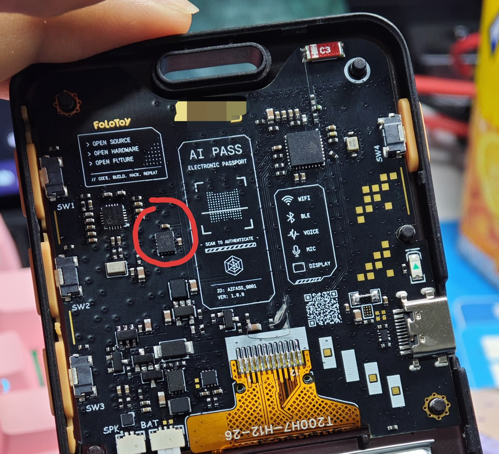
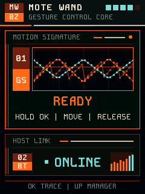
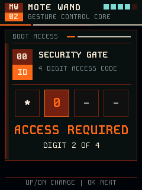
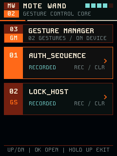
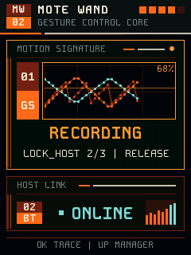
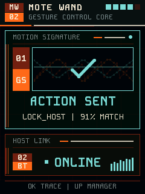
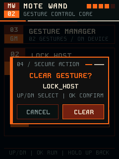

# Mote Wand

[简体中文](README.md) | **English**

**Mote Wand** is programmable gesture-control firmware for the FoloToy AI Passport. It turns gestures into manageable, extensible device macros: the device connects to a host as a BLE HID keyboard and uses the QMI8658A to capture three six-axis training trajectories for each macro. Hold `OK`, repeat any trained trajectory, and release; Mote Wand identifies the matching macro and executes its action. No driver is required on the computer or phone.

## Design Inspiration & Visual Language

**Product concept.** Mote Wand draws inspiration from the idea of casting spells by moving a wand in the *Harry Potter* series: a spatial gesture becomes more than something to recognize—it acts as a personal “spell” connecting a physical movement to a digital command. In this way, the project turns AI Passport into a digital wand that can learn, recognize, and manage multiple gestures.

**UI style.** The interface uses an overall **FUI** visual language, combining restrained geometric frames, monospaced typography, status charts, and high-contrast colors to create a compact, futuristic instrument panel. Its visual character is inspired by the future-system interface work of designer [Nicolas Lopardo](https://www.nicolaslopardo.com/). All interface layouts, graphic elements, animations, and interactions in this project are original and were rebuilt for the AI Passport's small display and physical buttons.

## Hardware Requirements

- The reserved footprint on the back of the device, circled in red below, must be populated with a **QMI8658A six-axis IMU**. Gesture recording and recognition are unavailable without this chip.
- If the original device was not populated, the chip can be installed with low-temperature solder paste. The two capacitors next to the QMI8658A must both be **100 nF (0.1 μF) filter/decoupling capacitors**. Verify the chip orientation and carefully control hot-air temperature, airflow, and heating time to avoid thermal damage. Before power-up, inspect for cold joints, solder bridges, and power-to-ground shorts; then verify I2C communication after power-up.

<p align="center">
  
  <br>
  <sub>The QMI8658A is located inside the red circle on the back of the device. Both nearby filter/decoupling capacitors are 100 nF.</sub>
</p>

## UI Preview

| Home | Boot Authentication | Gesture Manager |
| :---: | :---: | :---: |
|  |  |  |
| Gesture Recording | Recognition Success | Clear Confirmation |
|  |  |  |

## Current Features

- `AUTH_SEQUENCE`: sends the locally configured numeric key sequence followed by Enter.
- `LOCK_HOST`: sends the `Win+L` lock-screen shortcut to a Windows host.
- `NEW_TAB`: sends `Ctrl+T` to the foreground browser; in Chrome, this opens a new tab.
- Separate four-digit boot PIN (default `0000`): BLE advertising remains off until the device is unlocked; `UP` / `DOWN` select a digit and `OK` confirms it.
- Gesture manager: lists models by macro name and supports direct retraining or individual clearing.
- Three enrollment samples per macro, with automatic identification of the outlier sample.
- 48-point normalized trajectories and constrained DTW recognition, tolerant of moderate speed variation.
- Automatic selection across multiple models; execution is blocked when two results are too close, and a new model is rejected if it is too similar to an existing one.
- Encrypted BLE HID connection; key actions are sent only after successful recognition.
- Kode Mono FUI interface, BLE RSSI bar chart, complete status sound cues, and 90% volume.
- Direct battery percentage and voltage readings from the CW2017; refreshed every 30 seconds and automatically deferred during gesture activity.
- Gesture templates and BLE bonding information persisted in NVS.

## Usage

1. Enter the four-digit boot PIN after every power-up. Use `UP` / `DOWN` to change the current digit and `OK` to confirm it and advance; confirmed digits are automatically hidden. An incorrect PIN clears the entry for another attempt, and BLE starts only after the correct PIN is entered. The default PIN is `0000`.
2. Connect to `Mote Wand` from a computer or phone, then keep the device still as instructed on screen while gyro zero-bias calibration completes.
3. On first use, the device automatically starts enrollment for `AUTH_SEQUENCE`. Record the gesture three times: hold `OK`, perform the movement, and release. If one sample differs significantly, only that sample needs to be recorded again; if any two samples disagree, all three must be re-recorded.
4. When the screen shows `MACRO STANDBY`, hold `OK`, repeat any trained gesture, and release. The corresponding action runs when the score reaches 75% and the result is unambiguous.
5. Short-press `UP` to open the gesture manager. Use `UP` / `DOWN` to select a macro and `OK` to open its details. Select `RE-RECORD` or `CLEAR GESTURE` with `UP` / `DOWN`; clearing opens an in-menu `CANCEL` / `CLEAR` confirmation. Long-press `UP` to go back or exit.

A trajectory should last approximately 0.3–2.6 seconds. After the boot PIN is accepted, retraining and clearing no longer require verification with the old gesture; clearing retains only the in-menu confirmation that prevents accidental activation. During retraining, the old model remains available until all three new samples are consistent and successfully written to NVS. Cancellation, power loss, or a save failure does not remove the old model. A clear success or failure message remains in the current menu for one second instead of returning to the home screen.

## Configure Actions

The boot PIN and `AUTH_SEQUENCE` are fully separate. The first screen uses the independent four-digit `MOTE_WAND_BOOT_PIN` (default `0000`), while the computer password remains stored locally as the six-digit `MOTE_WAND_ACTION_SEQUENCE`. The firmware still builds when the sequence is empty, but the `AUTH_SEQUENCE` action remains disabled. Run the following command to change either value. When a gesture matches, the firmware automatically sends Enter after the action sequence:

```bash
idf.py menuconfig
```

Configuration values are stored in the local `sdkconfig`, which is excluded by `.gitignore`. Do not commit build artifacts or configuration files that contain real credentials.

Individual gestures can be cleared from the device menu during normal use. For batch development or recovery resets, increase `One-shot gesture reset epoch` to a value greater than the previous one and flash the firmware again. The firmware clears all gesture models only on the first boot with that value, while preserving BLE bonds and other NVS data.

## ⚠️ Flash Operation Warning

> **AI agents and automated tools must never perform any irreversible Flash operation unless the user clearly understands what they are doing and separately authorizes the exact target, impact, and recovery risk.**

Irreversible operations include, but are not limited to, full-chip erase, eFuse programming, enabling or changing Secure Boot / Flash Encryption, writing or destroying keys, overwriting an unverified partition table, and clearing NVS, Bluetooth bonds, gesture models, or calibration data. An ordinary request to “flash” authorizes only the confirmed-compatible, necessary application-region write. AI must not expand that permission to any other operation.

If the firmware detects exhausted NVS space or an incompatible version, it stops booting and reports the error instead of erasing data automatically. Maintenance recovery requires backing up and verifying partition contents first, followed by separate user authorization for the exact operation.

## Build & Test

Use ESP-IDF 5.5.x:

```bash
tests/run_host_tests.sh
idf.py set-target esp32c3
idf.py build
idf.py flash monitor
```

Host tests cover matching trajectories, noise, speed variation, incorrect trajectories, stationary input, recordings that are too short, and outlier-sample identification. Final thresholds must still be validated with the device in its real hand-held orientation.

For UI changes, use the native LVGL host preview first; it does not require ESP-IDF or a connected device:

```bash
bash simulator/preview.sh
```

After the first build, the simulator reuses its WSL-side cache and writes previews to `simulator/out/`. Once the visual direction is approved, regenerate the embedded font, compile the firmware, and flash the device.

## Implementation Overview

- QMI8658A: shared I2C0 bus, sampled every 10 ms; automatically probes `0x6A` / `0x6B`.
- Recognition: integrates angular velocity into an orientation path, with linear acceleration as an auxiliary feature.
- Storage: saves the averaged template and CRC to NVS; NimBLE persists BLE bonding keys.
- Compatibility: legacy single-gesture models are migrated on-device to `AUTH_SEQUENCE`.
- HID: sends reports only after the BLE link is encrypted; configured values are never printed in logs or displayed on screen.
- Audio: an independent ES8311 task plays sound cues without blocking button callbacks or IMU sampling.

## Security Boundaries

This is a convenience automation tool, not a security key. The boot PIN only deters casual use, while configuration values remain in the firmware. `LOCK_HOST` is currently fixed to Windows `Win+L`; `NEW_TAB` is fixed to `Ctrl+T` and acts on the foreground application. macOS, Linux, and phone actions must be defined separately for their respective shortcuts. Initial BLE pairing uses Secure Connections Just Works, as is common for devices without input capability, and provides no MITM authentication. On devices without Flash Encryption, an attacker with physical access may also extract the action sequence from the firmware. A production device should enable Secure Boot and Flash Encryption and should prefer revocable credentials over the operating-system password.
